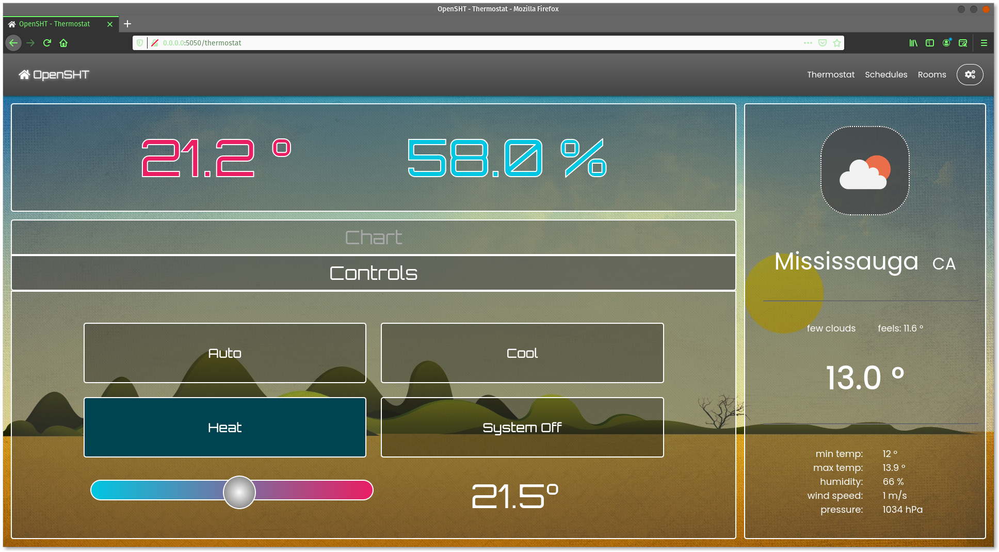
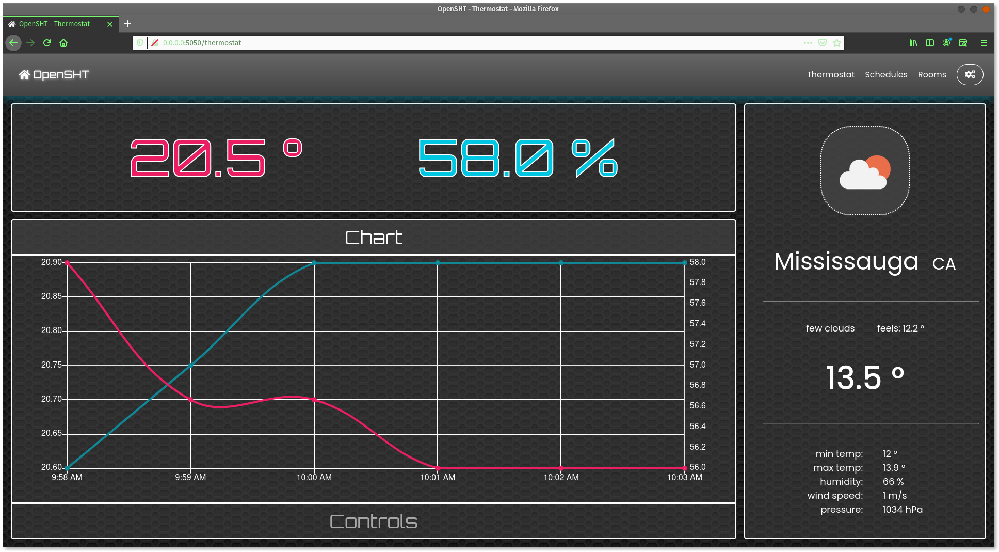

[OpenSHT.tech](https://opensht.tech/)

<h4>This project aims to fill a gap in the market of smart home thermostats for Do-It-Yourselfers; those looking to build their own projects without having to tackle the learning curve of larger ecosystems (OpenHAB, SmartThings, etc).</h4>

The end goal is to provide greater extensibility than modern competitors (EcoBee, Nest, etc) in terms of extra sensors and custom settings on your homes temperature control. Currently the system supports:

<ul>
	<li>up to x20 BLE temperature/humidity/motion sensors (Indoor/Outdoor)</li>
	<li>App settings for home, awake, and away temperature setpoints</li>
	<li>Intelligent operation by correlating with outdoor temperature (OpenWeatherMap/Sensors)</li>
</ul>

## Table of Contents

* [RoadMap](https://github.com/OpenSHT/SmartHub#roadmap)
* [Raspberry Pi Setup](https://github.com/OpenSHT/SmartHub#raspberry-pi-setup)
* [Troubleshooting](https://github.com/OpenSHT/SmartHub#troubleshooting)
* [Technologies](https://github.com/OpenSHT/SmartHub#technologies)
* [Requirements](https://github.com/OpenSHT/SmartHub#requirements)
* [Screenshots](https://github.com/OpenSHT/SmartHub#screenshots)

## RoadMap
#### Current Features:
<ul>
    <li>Responsive and <b>mobile friendly</b> Web APP that can set a centered background image, tiled image, or a custom color</li>
    <li>Thermostat support for modern HVAC systems that <u><b>DO NOT</b></u> have a compressor</li>
    <li>Seperate thermostat settings for Home Awake, and Away</li>
    <li><a href="https://openweathermap.org/">OpenWeatherMap</a> API integration</li>
    <li>ESP32 NodeMCU External sensors feeding local and remote sensor data</li>
    <li>Support for the <b>DHT 11 / 22 / 21</b> on a GPIO connection</li>
    <li>Support for any micro-controller streaming the data as (hum,temp):</li>
    
        <64.8,23.5>
   <li>C/C++ code for the Arduino and ESP32 NodeMCU using the DHT11/22 sensor</li>
</ul>

#### Future Hub Integrations:
<ul>
    <li>Alexa API</li>
    <li>Google SmartHome</li>
    <li>IFTTT</li>
    <li>OpenHab</li>
    <li>SmartThings</li>
    <li>IOT Security Cameras (PiZero or other)</li>
    <li>Possibly other sensors that are on the market</li>	
</ul>

#### Features in need of <u><b>YOU!</b></u>, the open source community
<ul>
    <li>Additional Thermostat configurations, such as:
        <ul>
            <li>Compressor system</li>
            <li>Boiler system</li>
            <li>No common (White wire usually)</li>
            <li>Heat pump system</li>
	    <li>Humidifier/Dehumidifier?</li>
        </ul>
    </li>
	<li> Any of the aforementioned Integrations will be quite the project</li>
</ul>

## Raspberry Pi Setup:

#### (Tested on RPI 3B+, 3)
1. Write the iso using 'dd':
	
		sudo dd bs=4M if=YYYY-MM-DD-raspios-buster-armhf.img of=/dev/sdb conv=fdatasync status="progress"
	
2. If using the HDMI&USB Connected TFT Touchscreens 'made' for RPi:
   
    i. With the fresh SD still plugged in, access the "/boot/config.txt" file
   
    ii. add the following options:
        
            hdmi_force_hotplug=1
            hdmi_group=2
            hdmi_mode=87
            hdmi_cvt=800 480 60 6 0 0 0
            hdmi_drive=1
            max_usb_current=1
            
    iii. Be sure to change to the appropriate resolution for the screen       
         
* NOTE: if you need ssh on first boot, place an empty file named '.ssh' in /rootfs
3. Setup Auto Update:
    
        sudo apt-get install unattended-upgrades
	
4. Configure interfaces and hostname etc...:
        
    i. Open terminal and type:
    
        sudo nano /etc/hosts
        
    ii. add the hostname 'openhub' to localhost as well as any 'static' IP you may have reseved on your router 
        
## Troubleshooting

- "Permission denied" when trying to read a serial device:
    
        - sudo chmod a+rw /dev/ttyUSB0
        
        
## Technologies
<ul>
	<li>Vanilla JS, CSS3, HTML5</li>
    	<li><a href="https://jquery.com/download/">jQuery v3.5.1</a></li>
	<li><a href="https://jqueryui.com/download/">jQuery-UI v1.12.1</a></li>
    	<li><a href="https://www.chartjs.org/">Chart.js v2.93</a></li>
</ul>

## Requirements:
<ul>
	<li>Flask>=1.1.2</li>
    	<li>Flask-APScheduler>=1.11.0</li>
	<li>pyserial>=3.4</li>
</ul>

## Screenshots

 
 

#### /thermostat             |  chart
:-------------------------:|:-------------------------:
 | 

#### /schedules  |  #### /settings
:-------------------------:|:-------------------------:
 | 
 | 

